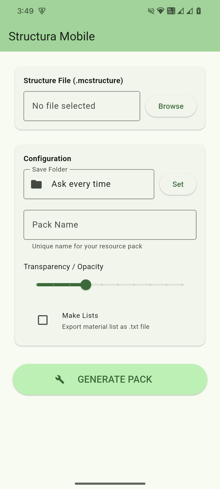
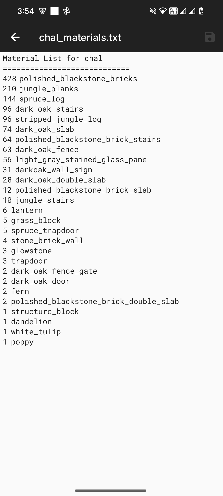
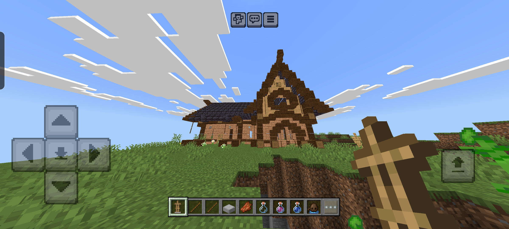

# Structura Mobile (Unofficial Android Build)

Structura Mobile is an **unofficial Android version** of **Structura**, a tool that generates resource packs for **Minecraft Bedrock Edition**.

It converts `.mcstructure` files into **armor stand–based hologram overlays**, so you can see and follow a structure in-game while building.

This is **not an official release** and is **not affiliated with Mojang or the original Structura developer**.  
I mainly made this so Structura can be used on Android devices 😄

---

## Credits

- **Android Port / Mobile Stuff**: **joncarl-15(sudo-carl)**
- **Original Structura Creator**: **RavinMaddHatter**  
  - Original project: https://github.com/RavinMaddHatter/Structura

All credit for the original idea and logic goes to the original author.  
I just handled the mobile conversion side of things.

---

## Details

- **Original Program**: Python  
- **Why Flutter?**: Because Flutter is the easiest way for me to do mobile development 
- **Framework**: Flutter (cross-platform UI toolkit)  
- **Language**: Dart  
- **Target Platform**: Android  
- **Minimum Android Version**: Android 5.0+

This project was converted from Python to Flutter mainly because it’s what I’m most comfortable using.  
Not the fanciest setup, but it works and that’s the goal.

---

## Why I Made This

I made this because a friend of mine wanted to use Structura but didn’t have a PC to run the original program.

Since most people already have a phone, the goal was simple: **make Structura accessible on Android**.  
This project is about **accessibility**, so builders can use the tool even if mobile is all they have.

If this helps even one person build more easily, then it already did its job 🙂

---

## Features

- **Generate Resource Packs**  
  Turn `.mcstructure` files into Bedrock resource packs directly on your phone.

- **Transparency Slider**  
  Change how visible the hologram is so it doesn’t block your view while building.

- **Material List (Optional)**  
  Export a text file that lists all blocks needed for the build.

- **Remembers Output Folder**  
  No need to reselect the folder every time.

---

## Screenshots

  
  

---

### Mobile Requirement (Important)

On mobile, Minecraft Bedrock does not include an export button for Structure Blocks by default.

To export .mcstructure files on Android, you need this installed:

Structure Block Export Button for MCPE
https://mcpedl.com/structure-block-export-button-for-mcpe/

Without this , you won’t be able to export structure files from Minecraft on mobile.

---

## How to Use

1. Pick a `.mcstructure` file.
2. Choose where the resource pack will be saved.
3. Adjust the transparency.
4. Tap **GENERATE PACK**.
5. Import the `.mcpack` into Minecraft Bedrock.

---

## Known Limitations (Will be fixed in the future if i have free time!!!)

- **Decorative / Complex Blocks**  
  Blocks like lanterns, chains, doors, etc. might show up as full cubes in the hologram.

  This is **only visual** — block positions are still correct.

---

## Compatibility & Performance

- **Android**: 5.0+  
- **CPU**: Supports both 32-bit and 64-bit devices

### Performance Notes

- Big `.mcstructure` files (10k+ blocks) will take longer to generate.
- Speed depends on your phone’s CPU and RAM.
- On lower-end devices, the app may freeze for a bit while generating — that’s normal.

---

### Tested Devices

- Cmf by Nothing Phone 1 (Android 16)

---

## Disclaimer

- This is an **unofficial project**.
- Minecraft is a trademark of **Mojang AB**.
- Structura and its original logic belong to **RavinMaddHatter**.
- This project follows the original license.
